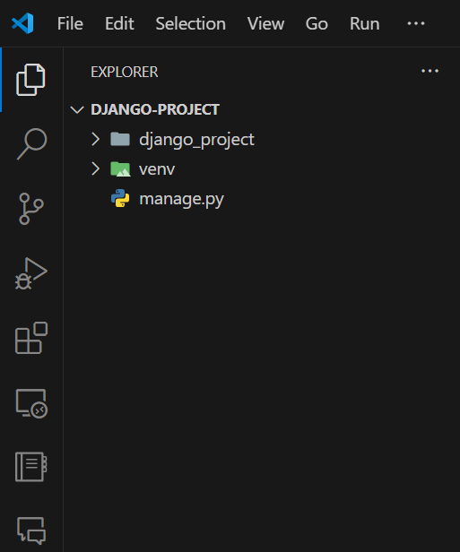
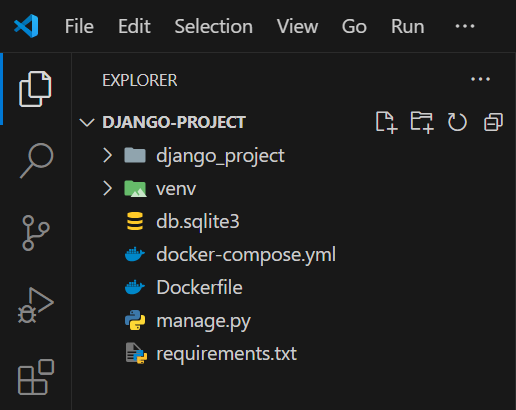

# The Basics

Welcome to this simple guide, where I will be showing you how to containerize your Django app with Docker. Before we begin, there's a couple of prerequisites. Here is a simple checklist to get you started:

- A Django project
- Docker installed on your machine
- Basic knowledge of Docker and Django
- A cup of coffee (optional)

# Step 1: Setting Up Your Django Project

First things first, you need to have a Django project. If you don't have one, you can create a new project by running the following commands. P.S. We will use venv to create a virtual environment. Skip this step if you already have a Django project.

```bash
mkdir project_name
cd project_name
python3 -m venv venv
```

Activate the virtual environment:

For Linux/Mac:
```bash
source venv/bin/activate
```
For Windows:
```bash
.\venv\Scripts\activate
```

Install Django:
```bash
pip install django
```

Create a new Django project in the current directory:
```bash
django-admin startproject project_name .
```
Open the project in your favorite code editor. I am using Visual Studio Code. The project structure should look something like this:



Pheew! That was a lot of setup. But we are just getting started. Let's move on to the next step. 

# Step 2: Dockerizing Your Django App

Now that you have your Django project setup AND Docker installed, it's time to create a Dockerfile. In case you are wondering, a Dockerfile is a text document that contains all the commands a user could call on the command line to assemble an image. What is an image, you ask? An image is a lightweight, stand-alone, executable package that includes everything needed to run a piece of software, including the code, a runtime, libraries, environment variables, and config files. You can think of it as a snapshot of your application. Anyone with Docker installed can run your image and get the same results as you. This eliminates the "It works on my machine" problem. 

Also, while we are at it, we will create a `requirements.txt` file. This file contains all the dependencies required by your Django project. Just run the following command to generate the file:

```bash
pip freeze > requirements.txt
```
And boom! You have a `requirements.txt` file in your project directory, which contains all the dependencies required by your Python project. Notice that we are using `pip freeze` to generate the file. This command outputs all the installed packages in the current environment, even the ones you don't need. You can manually remove the unnecessary packages from the file so that your Docker image doesn't get bloated with unnecessary dependencies.

Create a new file named `Dockerfile` in the root of your Django project and add the following content. Don't worry, I will explain each line.

```Dockerfile
# Pull base image
FROM python:3.10.4-slim-bullseye

# Set environment variables
ENV PIP_DISABLE_PIP_VERSION_CHECK 1
ENV PYTHONDONTWRITEBYTECODE 1
ENV PYTHONUNBUFFERED 1

# Set work directory
WORKDIR /code

# Install dependencies
COPY ./requirements.txt .
RUN pip install -r requirements.txt

# Copy project
COPY . .
```

Let's break down the Dockerfile:

The first line `FROM python:3.10.4-slim-bullseye` pulls the base image of Python 3.10.4 from Docker Hub. We are using the slim version of the image to keep the size small. You can take a look at the available Python images on Docker Hub [here](https://hub.docker.com/_/python). There are a lot of options to choose from.

The next three lines set environment variables. `ENV PIP_DISABLE_PIP_VERSION_CHECK 1` disables the pip version check. `ENV PYTHONDONTWRITEBYTECODE 1` prevents Python from writing pyc files to disc. `ENV PYTHONUNBUFFERED 1` ensures that Python prints directly to the console without buffering. This is useful for logging. Also, setting `PYTHONUNBUFFERED` to 1 is recommended when running Python in Docker containers. This is because it doesn't buffer the output, which avoids complications with log messages not appearing in the correct order as well as the output being delayed, which is a common issue when running an application in a container.

The `WORKDIR /code` command sets the working directory inside the container to `/code`. This is where our project will be stored. You can name it anything you like. This will not appear on your local machine, only inside the container. 

The `COPY ./requirements.txt .` command copies the `requirements.txt` file from your local machine to the container so that the image can install the dependencies without us manually installing them once again.

The `RUN pip install -r requirements.txt` command installs the dependencies required by your Django project. This is done inside the container.

The `COPY . .` command copies the entire project to the container. The first dot represents the location of the project on your local machine, and the second dot represents the location inside the container. This is done so that the container has access to all the project files. As usual `.` represents the current directory. 

And that's it! You have successfully created a Dockerfile for your Django project. Now, let's move on to the next step.

# Step 3: docker-compose.yml

While you can build and run your Docker image using the `docker build` and `docker run` commands, it's not the most efficient way to do it. You would have to remember the commands and type them every time you want to build and run your image. This is where `docker-compose` comes in. Docker Compose is a tool for defining and running multi-container Docker applications. With Compose, you use a **YAML** file to configure your application's services. Then, with a single command, you create and start all the services from your configuration.

So why not just create one. Create a new file named `docker-compose.yml` in the root of your Django project and add the following content:

```yaml
version: "3.9"

services:
  web:
    build: .
    command: python /code/manage.py runserver 0.0.0.0:8000
    volumes:
      - .:/code
    ports:
      - "8000:8000"

```

Let's break down the `docker-compose.yml` file:

The `version: "3.9"` specifies the version of the Compose file format. You can find more information about the Compose file format [here](https://docs.docker.com/compose/compose-file/).

The `services` section defines the services that make up your app. In this case, we have one service named `web`. You can name it anything you like. In my case, I have named it `web` because it's a web service. And since it's a Django project. You can name it `django` or `app` or anything that makes sense to you.

The `build: .` command tells Docker to build the image using the Dockerfile in the current directory. The dot represents the current directory.

The `command: python /code/manage.py runserver 0.0.0.0:8000` command overrides the default command specified by the image. In this case, we are running the Django development server, which will now be accessible from your local machine at `http://localhost:8000` automatically after running the `docker-compose up` command. More on that later. 

The `volumes: - .:/code` command mounts the current directory on your local machine to the `/code` directory inside the container. Remember, the `/code` directory is where we copied our project files in the Dockerfile. This is done so that any changes you make to your project files are reflected inside the container.

The `ports: - "8000:8000"` command maps port 8000 on your local machine to port 8000 inside the container. This is done so that you can access the Django development server running inside the container from your local machine.


And that's it! You have successfully created a `docker-compose.yml` file for your Django project. Now, let's move on to the next step.

The final directory structure should look something like this:



# Step 4: Building and Running Your Docker Image

The simplest way to build your Docker image is to run the following command in the root of your Django project:

```bash
docker-compose up --build -d
```

The `docker-compose up --build -d` command builds the image and runs the container in detached mode. The `--build` flag tells Docker to build the image before running the container. The `-d` flag tells Docker to run the container in detached mode. This means that the container will run in the background, and you can continue using your terminal.

Once the container is up and running, you can access your Django project by visiting `http://localhost:8000` in your browser. You should see the Django welcome page.

To stop the container, run the following command:

```bash
docker-compose down
```

It is not a good idea to build the image every time you want to run the container. You can simply run the following command to start the container:

```bash
docker-compose up -d
```
This works similar to the `docker-compose up --build -d` command, but it doesn't build the image every time you run the container. It uses the existing image and runs the container in detached mode.

And that's it! You have successfully containerized your Django app with Docker. You can now share your Docker image with anyone, and they can run your Django project without any issues. This is the power of Docker. 

Me happy. You happy. Everyone happy. 🎉

Thanks for reading. I hope all your apps work on all machines.
In case someone is unable to run your app, just tell "Skill issue." Don't try this with your clients. You know what, try and see what happens. 