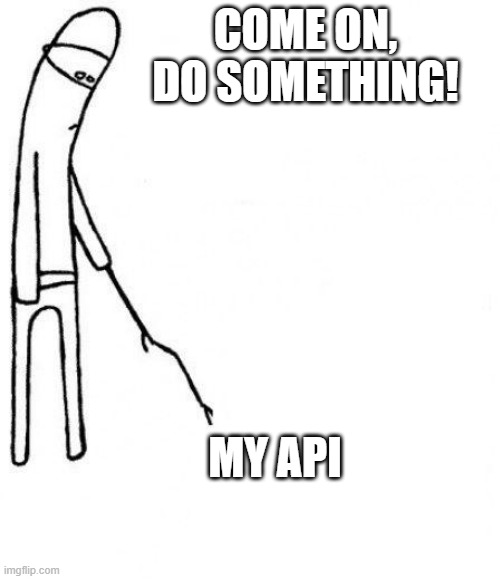

# Some context

I was 7 days into a take-home assignment when Supabase decided my project had been "inactive" for too long. Apparently, actively developing doesn't count if you don't hit the database every week.

That weekend of work was gone, and I had to explain to the company why my demo was returning 500 errors. Fun conversation.

My first solution was a quick Python script that pinged my APIs and database every few hours. Worked great for keeping things alive, but checking logs to see if everything was actually healthy got old fast.

So I built a simple web interface for myself. Then I thought, "other solo devs probably have this problem too." That was a week of coding. Last week, I launched LookOut.

## The evolution from CLI to platform

The original script was embarrassingly simple:

```python
# v0.1 - the MVP that started it all
import requests
import time

ENDPOINTS = ["https://myapp.com/api/health", "https://mydb.supabase.co"]

while True:
    for url in ENDPOINTS:
        try:
            requests.get(url, timeout=10)
            print(f"✓ {url}")
        except:
            print(f"✗ {url}")
    time.sleep(3600)
```

I mean not exactly this, but you get the idea. Python, just because.

{/* Meme Image */}



This kept my projects alive but told me nothing about when things actually broke. Like, did my API return a 500 error or just take too long? I needed more than just "up" or "down." So I built a simple dashboard to visualize the results.

The web version started as a dashboard to view the CLI results. But once I had a database tracking check results, I realized the CLI was redundant. The webapp could do the monitoring too.

Then I started thinking about workspaces, user accounts, notifications... suddenly I had a full monitoring platform.

## Architecture decisions

### The monitoring engine

Most monitoring tools check frequently and alert constantly. LookOut does the opposite - checks based on what you actually need, and only bothers you when it's actually broken.

Each endpoint has its own check schedule. Your critical API might get checked every few minutes, while your portfolio site gets checked hourly. The monitoring service runs independently and just writes results to the database.

When endpoints fail, they increment a `consecutive_failures` counter. Recovery resets it to zero. Notifications only fire after hitting a user-defined threshold, so brief hiccups don't wake you up at 3am.

### Notification logic (the hard part)

Nobody wants 47 emails when their API has a rough day. But you also can't just ignore repeated failures and pretend everything's fine. Dependabot is not it, trust me. It can catch these hands for all I care.

LookOut batches notifications using a buffer system. When the first endpoint hits its failure threshold, it starts a 15-minute collection window. Any other failures during this window get grouped into one email.

After sending the notification, there's an escalating cooldown (1hr → 2hr → 3hr → 5hr → 8hr). During cooldown, failures are tracked but emails aren't sent. This prevents spam while keeping you informed.

It took several iterations to get this right. Too sensitive and you ignore alerts. Too conservative and you miss real problems. The current approach seems to hit the sweet spot.

### Real-time dashboard

The dashboard updates through a combination of caching and intelligent refetching. React Query handles client-side state with a 5-minute stale time, meaning data stays fresh without constant server hits.

When you need immediate updates, there's a manual refresh button that refetches all dashboard data. The backend uses Redis caching with a 60-second TTL to balance freshness with performance.

No WebSockets or complex real-time infrastructure - just smart caching that works.

### Security considerations

Letting users submit arbitrary URLs for monitoring is basically handing them an SSRF vulnerability. The URL validator blocks private IP ranges, localhost patterns, and suspicious ports. Like come on devs, level up your game. Why do you need to monitor `http://localhost:3000`? 

There's also basic abuse prevention - rate limiting on endpoint creation and reasonable bounds on check intervals. Nothing sophisticated, but enough to prevent obvious misuse.

## Technical challenges

### Defining failure

HTTP status codes don't tell the whole story. A 200 response that takes 30 seconds or returns unexpected content is still a failure in practice.

LookOut defines success as: expected status code + response under timeout + no connection errors. Everything else counts as failure. This catches most real issues without too many false positives.

### Email reliability

Getting notification emails past spam filters requires actual email infrastructure. I use Brevo rather than building SMTP handling from scratch, because there are better uses of development time.

The templates are deliberately simple - clear information about what failed and when, no fancy graphics that might trigger filters.

### Database consistency

The monitoring engine runs independently from the web API, both writing to the same database. Ensuring data consistency across concurrent monitoring processes requires atomic updates and proper constraints.

The current approach uses database-level constraints and careful transaction boundaries. Simple but reliable.

## What I learned

Building a monitoring platform taught me more about failure modes than I expected. Systems break in creative ways, and handling edge cases is harder than the happy path.

The notification logic took several iterations to get right. Too sensitive and you get alert fatigue. Too conservative and you miss important outages. The buffer + cooldown approach seems to hit the sweet spot.

The hardest part wasn't the technical implementation - it was figuring out what users actually need versus what they think they want. Most people don't need sub-second monitoring; they need reliable alerts when things are actually broken.

## Launch week

LookOut went live last week after a week of intense coding. The response has been... well, it exists now. Turns out launching is easier than getting people to actually use your thing.

Current stats: A couple of users besides me, but our endpoints are very well monitored. The platform handles our projects reliably, which was the original goal anyway.

## What's next

The obvious additions are webhook notifications and Slack integration. But honestly, I want to avoid feature creep. LookOut is meant to be simple and effective, not a bloated mess. Also, user profiles and more features for workspace management are under consideration. I don't want to beat a dead horse with features that nobody asked for.

But honestly, the current feature set handles most of what people need. Sometimes the best software is the kind that works quietly in the background without requiring constant attention.

Unironically, LookOut now looks out for LookOut itself. Yes, I monitor my own monitoring service. I just don't subscribe to the notifications because if something breaks, some other guy will already have complained about it on X/Twitter.

---

*LookOut is live at [lookoutapi.xyz](https://lookoutapi.xyz). Built by a solo developer who got tired of projects randomly breaking. You know the feeling. Let me know what you think!*

PS: A technical deep dive is coming very very soon.