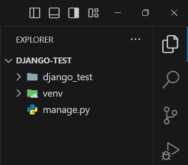
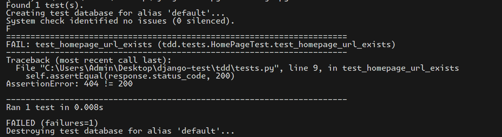
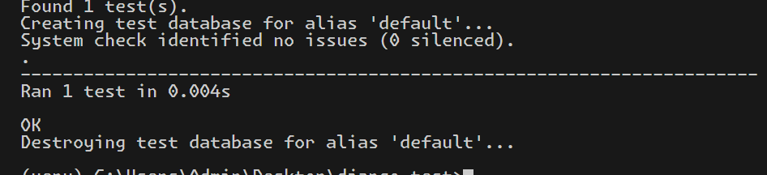
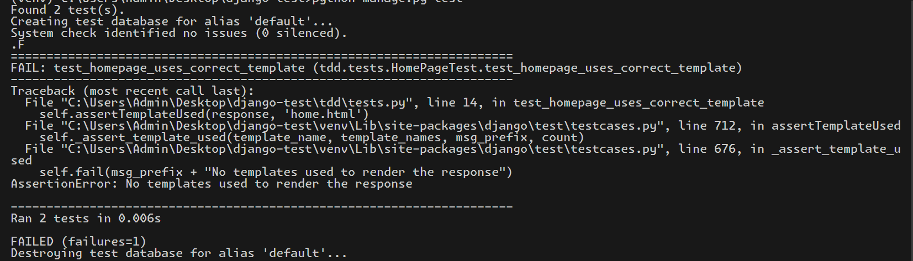
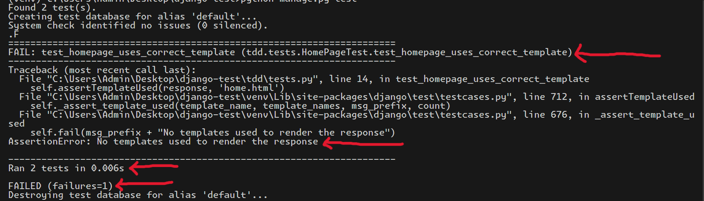
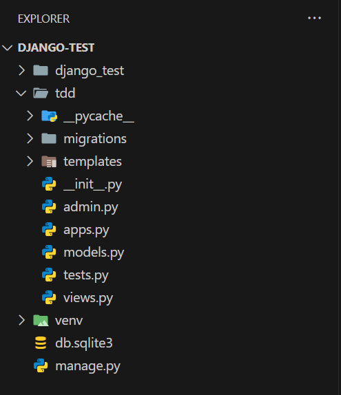
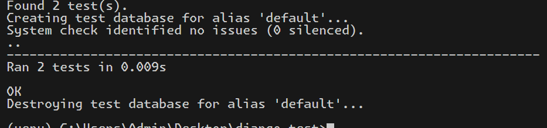
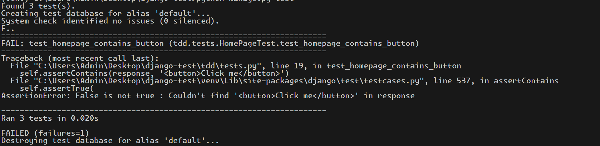
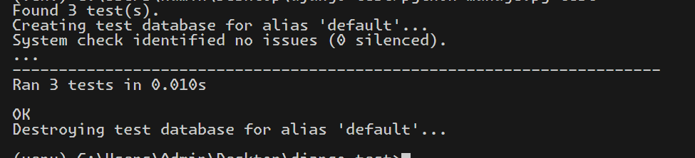

# Why TDD?

If you have ever taken a Software Engineering class which didn't suck, chances are you've heard of Test-Driven Development (TDD), otherwise known as "fix before it breaks" or "break before it works". It is a simple concept: write a test, fail the test (because the code doesn't exist yet), write the code, pass the test, refactor the code, and repeat. Sounds simple, right? Once for a change in software development, it actually is. But, it is not the easiest thing in the world. You need to have a very good understanding of what you're building and how it can break. Otherwise, you'll just keep on writing the same test over and over again. And that's not efficient.

Why do TDD anyway? Why not just write the code, build what you want, and be done with it since you already know what you're building? Excellent question. There is no problem with that approach. But what if you don't know the behavior of the stuff you're building? What happens when something goes wrong then? In that case, it would be better to test the basic functionality of the code before you write Item. Sure, you can write tests after you implement the functionality, but that would mean that you'll have to rewrite the implementation if the test fails. Writing tests before writing code ensures that you know what you're building and how it should behave. It also ensures that you don't write more code than you need to. Also, you don't have to find out what went wrong in case something isBreakStatement. The test will tell you what's wrong.

# How to TDD with Django?

Now that you have an idea as to what is TDD and why it is used so prominently, it is time we also learn how to do TDD with Django. Assuming you already know your way around Django and how to build a basic Django project, let's get started with TDD.

## Setup

The basic setup for TDD with Django is the same as setting up a Django project. No additional steps are required. The inbuilt `TestCase` module in Django is pretty good by itself. But if you need more features such as test coverage (how much of your code is covered by tests), parallel testing, etc., you can use the `pytest` module. We will explore the powers of `pytest` later.

## Writing Tests

Here is a a quick look at my Django project structure:



I will now create a simple html page which will have some text and a button. When the button is clicked, the text will change. As you guessed it, I need to first setup the required templates and views. But since we are doing TDD, let's write the test first. i'll initialise a new django app and call it `tdd`. Inside the `tdd\tests.py` file, you will have the following code prewritten:

```python
from django.test import TestCase

# Create your tests here.

```

Pretty boring but we can make it better. Let's write a test to check if a url at `'/'` exists. I will use class-based test case for this example. You can use function-based test cases as well.

```python
from django.test import TestCase

class HomePageTest(TestCase):

'''test case to test the home page at the url '/' '''
    def test_homepage_url_exists(self):
        response = self.client.get('/')
        self.assertEqual(response.status_code, 200)

```

The `client` attribute is used to simulate a user visiting the page. We simply check if the status code of the response is 200. If it is, the test passes. If not, the test fails. Now, let's run the test using the command `python manage.py test`. You should see the following output:



Pretty neat, right? Take some time to understand the log. What is the log telling us? Why did the test fail? What can we do to fix it? Once you have the answers to these questions, you can move on to the next step.

## Writing Code

Since we had no views configured to `'/'`, the test failed with a 404 error. We can easily fix that by sending a simple response from the view. Let's write some more code to make the test pass.

```python
# tdd/views.py

from django import http

def home_page(request):
    '''
    Sending a simple hello world message to the home page
    '''
    return http.HttpResponse('Hello, world!')

```

```python
# django_tdd/urls.py

from django.contrib import admin
from django.urls import path
from tdd import views as tdd_views

urlpatterns = [
    path('admin/', admin.site.urls),
    path('', tdd_views.home_page, name='home'),
]
```

Now, let's run the test again using the command `python manage.py test`. You should see the following output:



This time we pass the test since we get a status code of 200. to confirm this, fire up your development server and visit `'/'` in your browser. You should see the message `'Hello, world!'`. Congratulations! You have successfully written your first test and made it pass. But why stop here? Let's now write some more tests to complete the following checklist:

- [x] Test if the home page url exists
- [ ] Test if the home page returns the correct html file
- [ ] Test if the home page has a the correct elements

Let's get to it. Here is the code for the next test:

```python
# tdd/tests.py

from django.test import TestCase

class HomePageTest(TestCase):
    '''test case to test the home page at the url '/' '''
    def test_homepage_url_exists(self):
        response = self.client.get('/')
        self.assertEqual(response.status_code, 200)

    '''test case to test if the homepage returns the correct html file'''
    def test_homepage_uses_correct_template(self):
        response = self.client.get('/')
        self.assertTemplateUsed(response, 'home.html')

```

The test `test_homepage_uses_correct_template` checks if the template `'home.html'` is used when the user visits `'/'`. Since we haven't created the template yet, the test will fail. The output looks something like this:



Sheesh! Now that's a long error message. But don't worry, you just need to read only some of it. Here are some red arrows to help you out:



The first line tells us which test case findAllInRenderedTree, and the second one tells us why the test failed. Evrerything between them is the stack trace. The third line tells us that we ran **2** tests, which is correct and the fourth line tells us that **1** of them failed.

This is enough information for us. Notice how one test failing did not stop the other tests from executing. How about we fix the test now? Let's create the `home.html` file in the `templates` directory of the `tdd` app.

```html 
<!DOCTYPE html>
<html lang="en">
<head>
    <meta charset="UTF-8">
    <meta name="viewport" content="width=device-width, initial-scale=1.0">
    <title>TDD with Django</title>
</head>
<body>
    
    <h1>Welcome to TDD with Django</h1>

</body>
</html>
```

Cool, now your project structure should look something like this:



Since we are now accessing the templates from the `tdd`, it is only fair that we add it to the `INSTALLED_APPS` in the `settings.py` file. Add `'tdd'` to the `INSTALLED_APPS` list. Now, run the test again using the command `python manage.py test`. You should see the following output:



Great! That is one more item checked off the list. On to the last onemptied, checking whether certain elements exist on the page. Here is the code for the test:

```python
from django.test import TestCase


class HomePageTest(TestCase):
    '''test case to test the home page at the url '/' '''
    def test_homepage_url_exists(self):
        response = self.client.get('/')
        self.assertEqual(response.status_code, 200)


    '''test case to test if the homepage returns the correct html file'''
    def test_homepage_uses_correct_template(self):
        response = self.client.get('/')
        self.assertTemplateUsed(response, 'tdd/home.html')

    '''test case to test whether the home page contains a button element
    with Click me text'''
    def test_homepage_contains_button(self):
        response = self.client.get('/')
        self.assertContains(response, '<button>Click me</button>')
        ``` 
    
Run the tests again, and you should have another failing test. This time, the test fails because the button element is not present on the page. The output should look something like this:




Fix the test by adding the button element to the `home.html` file. Here is the updated code:

```html
<!DOCTYPE html>
<html lang="en">
<head>
    <meta charset="UTF-8">
    <meta name="viewport" content="width=device-width, initial-scale=1.0">
    <title>TDD with Django</title>
</head>
<body>
    
    <h1>Welcome to TDD with Django</h1>
    <button>Click me</button>

</body>
</html>
```

Run the tests again using the command `python manage.py test`. You should see the following output:




This clears off the last item on our checklist. You have successfully written tests for your Django project following the TDD apporach. You can now continue to write more tests for your project. Remember, the more tests you write, the more confident you can be about your code.

# Conclusion

This was a basic guide to TDD with Django. The tests we wrote were simple and straightforward. You can write more complex tests as your project and comfort with TDD grows. Remember, TDD is not about writing tests for the sake of writing tests. It is about writing tests to ensure that your code works as expected. It is tedious but works. 

I hope you found this guide helpful. 

Here are some more resources to help you get started with testing:

1. [Writing and Running Tests - Official Django Docs](https://docs.djangoproject.com/en/5.0/topics/testing/)

2. [The Basic of TDD and Django](https://www.obeythetestinggoat.com/book/part1.forbook.html)

3. [Django Testing Tutorial](https://learndjango.com/tutorials/django-testing-tutorial)

In future, I will be writing more about testing in Django using `pytest` and `unittest`. Stay tuned for more updates. Until then, happy coding!


